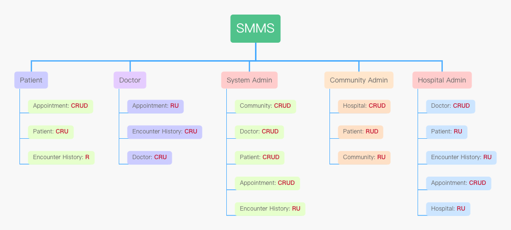

# Smart Medical Management System
## Introduction
This system mainly help different roles to manage all kinds of medical resources.

**👩🏻‍💻 Technology Stack**: Java + Swing + No database(use json file to persistent data)

**👩🏻‍💻 Project Structure:**
1. **assets**: Store static images and icons
2. **dao**: Implement CRUD on data models by reading and writing Json files
3. **database**: Store Json files as Database
4. **enumvalue**: Store Enum Type classes, like constant index value for different role
5. **model**: store data models that be abstracted from real world
6. **tool**: some static classes for data validation, date format conversion, Json2List, etc
7. **ui**: user interfaces and functions that implement specific functions

## Five Roles
As the pic shown, different role has different permissions to access resources.

1. Patient can access their own appointment, encounter history and patient info.
2. Doctor can manipulate appointment, encounter history and his/her own doctor info.
3. Community admin responsible for managing the hospital, patient info and own community info. One community has one admin to do this. Since the doctor should be a part of hospital's resources, the community admin cannot manage it. The community admin will be created when this community is created by system admin.
4. Similarly, one hospital has one admin to manage doctor, patient, appointment, encounter and this hospital's info.
5. Different from the roles above, system admin has a power to CRUD all kinds of info in this system, except for delete and add encounter history based on some reality thoughts.
He/She can create community admin and hospital admin meanwhile creating community and hospital.
Also, SA has power to help other roles to reset their password without verifying the old password.

### Key process
#### Registration and Login
